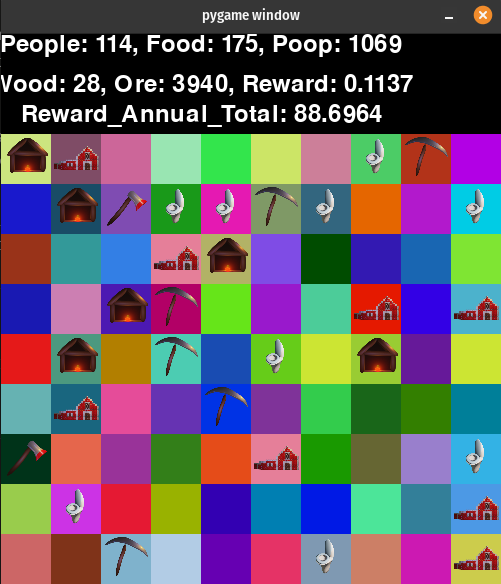

## Neighbourhood_Watch: PPO Town Management

RL agent that learns resource management and strategic planning through PPO. Built to explore reward shaping, spatial policy learning, and evaluation infrastructure challenges.

<p align="center">
  
</p>

ML code found in Council.py
Environment code found in Environment.py


## Run with

```bash
# Install dependencies
pip install -r requirements.txt

# Launch Jupyter
jupyter notebook

# Open NBHDWatch_MAIN.ipynb and run all cells
```


### Architecture

State Representation: Multi-channel spatial observation (4×10×10 grid: food/wood/ore density + building map) + global resource vector (stockpiles, population, waste). 

In the visualization above, tile colors encode resource densities (RGB channels: red=wood, green=food, blue=ore)

Policy Network: CNN processes spatial features → concatenated with global state → LSTM memory layer → policy head outputs building placement decisions. The LSTM maintains hidden state across timesteps, allowing the agent to develop temporal strategies.

Training: PPO with clipped surrogate objective, GAE for advantage estimation

Reward Design: Multi-objective function balancing resource accumulation, population growth, and infrastructure development. Reward shaping required to handle sparse signals and long-term dependencies.
